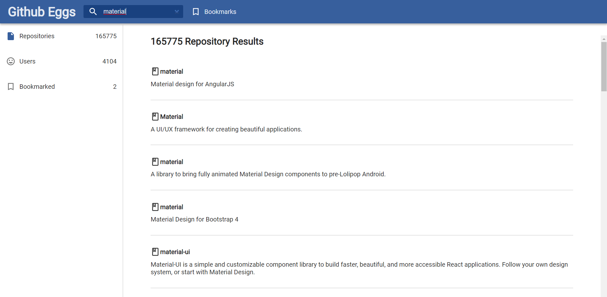
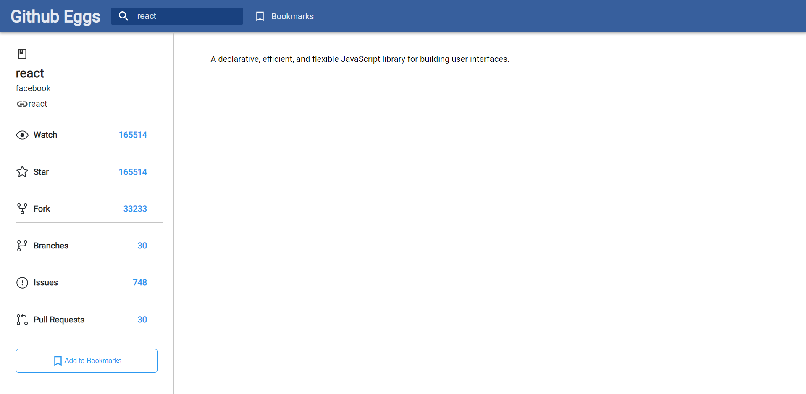
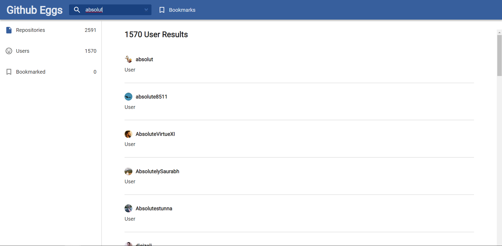
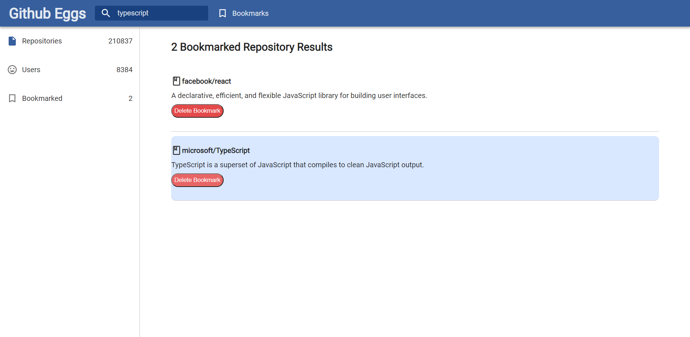
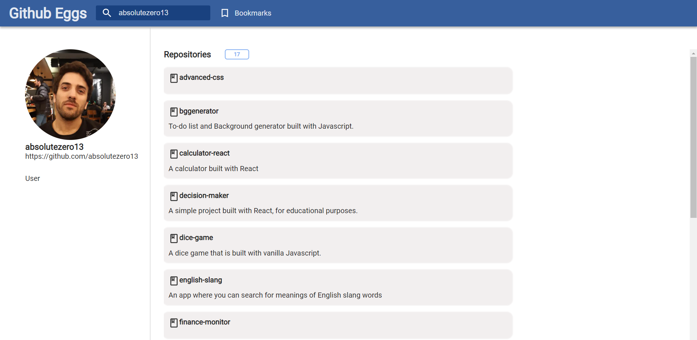
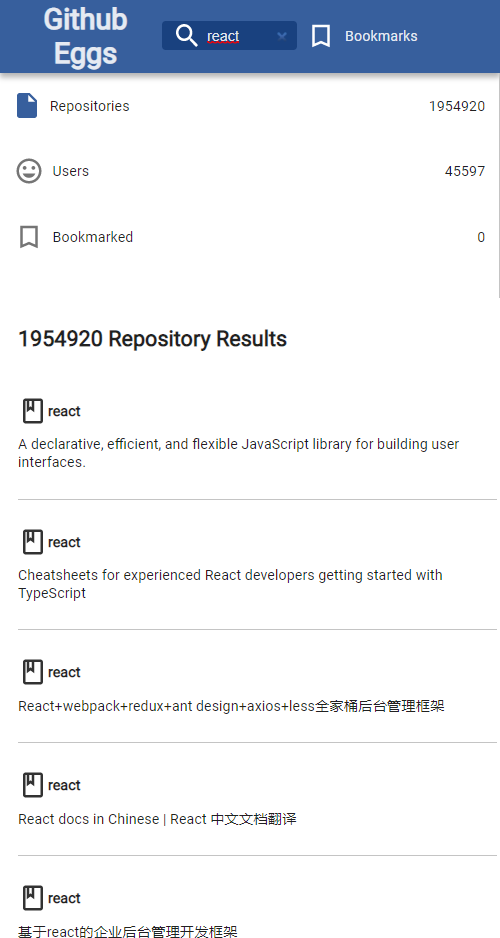

# Github Eggs

Github Eggs is using Github API to provide search results for both users and repositories. It also allows you to check repo and user details. Repositories can be bookmarked and stored in the local storage.

### The technologies used in this project

- React
- React Hooks
- Typescript
- Context API
- SCSS

<div>
 
 


</div>

## Installing

You can clone the project with the command below.

```
git clone https://github.com/absolutezero13/github-eggs.git
```

Navigate to the github-eggs folder and run this command:

```
npm install
```
